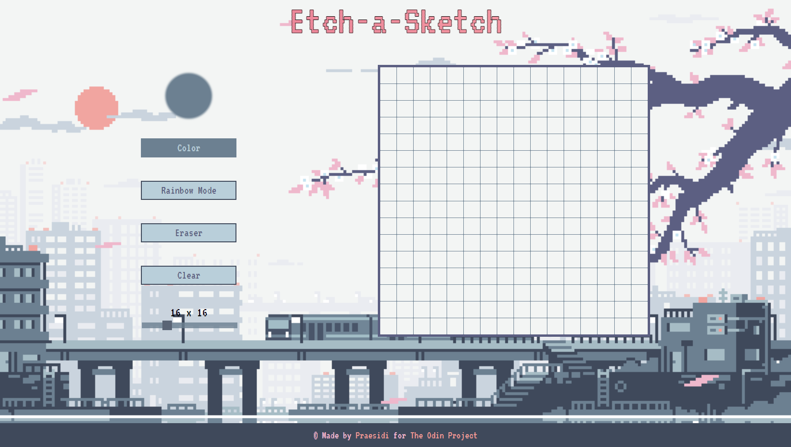

# Etch-a-Sketch

This project was created as a part of The Odin Project curriculum. I used only HTML, CSS, and Vanilla JS. 

🔗Live preview: [here](https://praesidi.github.io/etch-a-sketch/)

## Features 
***
*Draw with selected color
*Pick color from the whole page
*Use Rainbow Mode to color each cell with a random color
*Use Eraser if you want to erase only certain cell
*Clear the whole canvas
*Change resolution of the canvas with a slider 

## Summary
***
This project was really challenging for me. I had to learn a lot of new stuff but the result was worth it. Hope you liked it!

